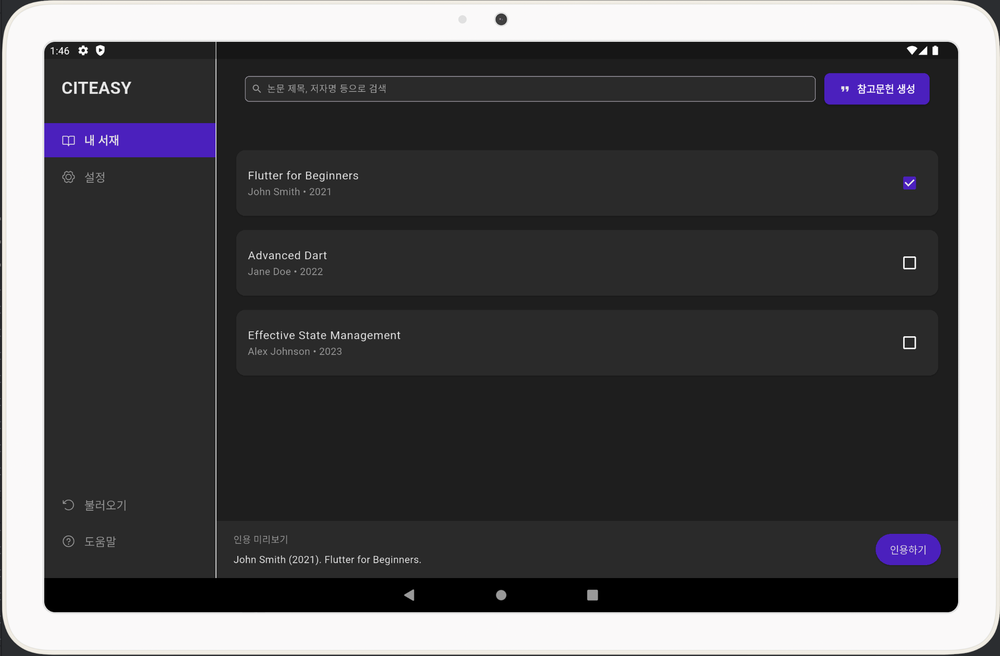
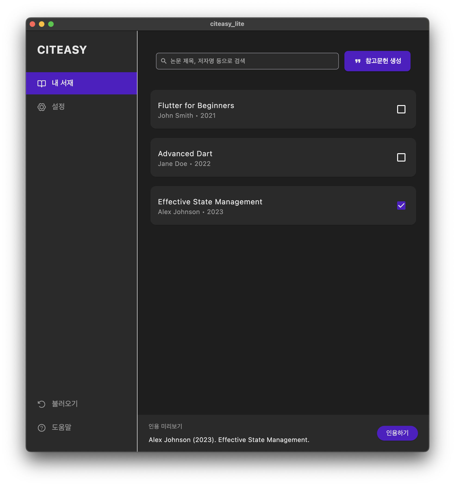

# Citeasy Lite

Citeasy Lite는 논문, 보고서, 레포트 등을 작성할 때 간편하게 참고문헌을 관리하고 인용 형식을 복사할 수 있는 Flutter 기반 멀티 플랫폼 앱입니다.

본 프로젝트는 Windows 앱 기반의 [싸이티지(Citeasy)] 사용 경험을 토대로 **macOS, iPad, Android, Windows** 등 다양한 플랫폼에서도 동일한 사용자 경험을 제공하기 위해 재구현되었습니다.


## ✨ Features

- 참고문헌 목록
- 인용하기 클립보드 복사 기능 제공
- 디자인 시스템 기반 UI 리팩토링
- 다크 테마 스타일 기반 컬러 시스템 적용
- 멀티 플랫폼 대응: macOS, Windows, iPad, iPhone


## 🖥 Preview

| iPad | Android Tablet | macOS | 
|------|----------------|---------|
|  |  |  |


## 📁 폴더 구조

```bash
lib/
├── constants/              # 컬러, 스타일 상수
├── models/                 # ReferenceItem 모델
├── views/                  # 메인 View (HomeView)
├── widgets/                # 재사용 가능한 위젯 (TopToolbar, PreviewPanel 등)
├── main.dart               # 엔트리 포인트
